<p align="center">
  
</p>

<p align="center">
  
  
  
  
</p>

<p align="center">
  <a href="#overview">Overview</a> &nbsp;·&nbsp; <a href="#features">Features</a> &nbsp;·&nbsp; <a href="#getting-started">Getting started</a> &nbsp;·&nbsp; <a href="#architecture">Architecture</a>
</p>

<br>

## Overview

Classical Arabic Poems is a Windows desktop application for building a structured archive of classical Arabic poetry, organised as books, poems and verses (each verse held as its two hemistichs). Beyond storage, it breaks every verse into tokens and uses the AlKhalil morphological analyser to suggest Arabic roots and part-of-speech tags, so a collection can be explored by root as well as by title. It is aimed at students and researchers of Arabic literature who need more than a text file: a searchable, editable corpus with linguistic metadata attached to every word.

## Features

| Capability | What it does |
| --- | --- |
| **Books** | Create books with title and author, rename or re-attribute them, see how many poems each holds, and delete a book together with its poems and verses. |
| **Poems and verses** | Add poems to a book, append verses hemistich by hemistich, edit titles and verse text, and remove a single verse or an entire poem. |
| **Bulk text import** | Load a whole book from a text file, chosen with a file picker or dropped onto the import panel. A state-machine parser reads the `الكتاب :` book header, `[title]` poem headings and `(hemistich ... hemistich)` verses, and skips blocks fenced between `___` and `==========` markers. |
| **Diacritic-free copies** | Every hemistich is also stored with its short-vowel marks (harakat) removed, giving a normalised form alongside the fully vocalised original. |
| **Tokenisation and tagging** | Split a verse into its unique words, save them as tokens, and attach part-of-speech tags produced by the AlKhalil 2 analyser. |
| **Root analysis** | Roots are extracted automatically for each token and marked *Automatic*; roots can also be assigned by hand and are marked *Verified*. Browse all roots with verse counts, list the verses behind a root, and open the full poem from any verse. |
| **Bilingual interface** | Switch the interface between English and Arabic at runtime from the language menu; table numbering is shown in Arabic-Indic numerals. |
| **Managed database lifecycle** | The app starts the local XAMPP stack on launch and stops it when the main window closes. |

## Tech stack

| Layer | Technology |
| --- | --- |
| Language | Java 8 (compiler compliance 1.8) |
| Desktop UI | Swing with FlatLaf (`FlatMacLightLaf`), SwingX autocomplete, NetBeans AbsoluteLayout |
| Arabic NLP | AlKhalil Morpho Sys 2 (`net.oujda_nlp_team.AlKhalil2Analyzer`) for roots and part-of-speech tags |
| Data access | JDBC with prepared statements, credentials read from a properties file |
| Database | MySQL, run through XAMPP at `C:\xampp` |
| Logging | Apache Log4j 2 |
| Testing | JUnit 5, with stub DAOs isolating the business layer |
| Distribution | Windows installer (`ClassicalArabicPoems.exe`) plus install and uninstall batch scripts |

## Getting started

### Prerequisites

- Windows, since the app launches XAMPP from the fixed path `C:\xampp` and reads its config through a Windows-style relative path
- JDK 8 or later
- [XAMPP](https://www.apachefriends.org) installed at `C:\xampp`
- The following libraries on the classpath (none are bundled in the source tree): FlatLaf, SwingX, AlKhalil Morpho Sys 2, Apache Log4j 2, NetBeans AbsoluteLayout, a MySQL JDBC driver, and JUnit 5 for the tests

### Option A: Windows installer

The `ClassicalArabicPoems Setup` folder contains a packaged installer and helper scripts.

1. Make sure no `C:\xampp` folder exists yet, then place the XAMPP installer next to `install.bat` and name it `xampp_installer.exe`.
2. Run the install script. It installs XAMPP to `C:\xampp`, runs the application setup, and loads the database schema into a MySQL database named `classicalarabicpoems`.

   ```bash
   cd "ClassicalArabicPoems Setup"
   ./install.bat
   ```

3. If XAMPP is already installed at `C:\xampp`, run `ClassicalArabicPoems.exe` directly, then run `databaseSetup.bat` from the installation directory (by default `C:\Program Files (x86)\ClassicalArabicPoems`) to create the database.

`uninstall.bat` stops the XAMPP services, runs the XAMPP uninstaller and then the application's own uninstaller.

### Option B: run from source

1. Clone the repository.

   ```bash
   git clone https://github.com/SyedAliMasoodBukhari/ClassicalArabicPoems-ManagementSystem.git
   cd ClassicalArabicPoems-ManagementSystem/Project
   ```

2. Create the database connection file. The app reads `config\config.properties` relative to its working directory and expects three keys:

   ```bash
   mkdir -p config
   cat > config/config.properties <<'EOF'
   db.url=jdbc:mysql://localhost:3306/classicalarabicpoems
   db.user=root
   db.password=
   EOF
   ```

   The schema script (`db\setup.sql`) used by the installer is not part of this source tree, so the database must already exist, for example from an installer run.

3. Put the required JARs in a `lib` folder, then compile, copy the UI resources and launch. From Git Bash on Windows:

   ```bash
   javac -encoding UTF-8 -cp "lib/*" -d bin $(find src -name "*.java")
   cp -r src/presentationLayer/images src/presentationLayer/*.properties bin/presentationLayer/
   java -cp "bin;lib/*" main.Main
   ```

   The folder is also an Eclipse Java project (`.project`, `.classpath`), so it can be imported directly and run from `main.Main` once the JARs are added to the build path.

The business-layer unit tests live in `Project/Tests` and run against the stub DAOs, so they need no database.

## Architecture

The application follows a strict three-layer design. `main.Main` wires everything together: it builds the four DAOs behind a single `DALFacade`, injects that into the four business objects behind a single `BLLFacade`, and hands the facade to the Swing window. The presentation layer only ever talks to `IBLLFacade`, and the business layer only ever talks to `IDALFacade`, which is what lets the tests swap in stub DAOs. Data moves between layers as transfer objects, and text import is modelled with the State pattern (`BookTitleState`, `PoemState`, `IgnoreState`, `StopState`).

```text
ClassicalArabicPoems-ManagementSystem/
├── ClassicalArabicPoems Setup/   Windows installer, install and uninstall scripts
└── Project/
    ├── src/
    │   ├── main/                 Entry point and XAMPP start/stop
    │   ├── presentationLayer/    Swing window, table renderers, EN/AR bundles, icons
    │   ├── businessLogicLayer/   Book, poem, token and root logic, import state machine
    │   ├── dataAccessLayer/      JDBC DAOs, facade, connection handling
    │   └── transferObject/       Book, poem, verse, token, tag and root TOs
    └── Tests/
        ├── businessLogicLayer/   JUnit 5 tests for each business object
        └── DAOStub/              In-memory DAO stubs
```

<br>

<p align="center">
  <a href="https://www.kolonx.com"></a>
</p>
